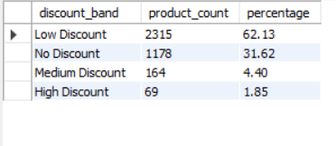
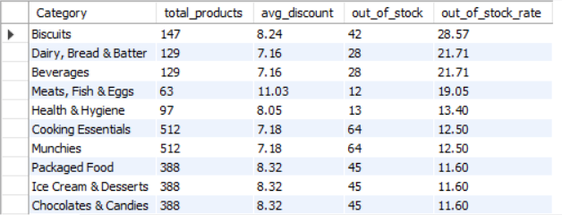
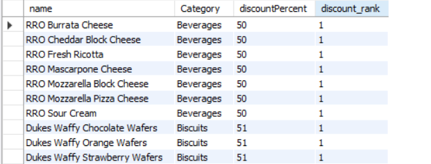
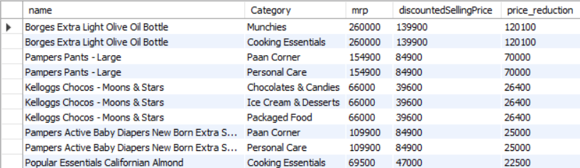

# Zepto Product & Inventory SQL Analysis

## Project Overview

This project analyzes a Zepto product/catalog dataset using MySQL.

The project focuses on data cleaning, data quality validation, product discounts, category-level inventory, stock availability, and advanced SQL analysis.

## Dataset

The dataset contains product-level information including:

- Category
- Product name
- MRP
- Discount percentage
- Available quantity
- Discounted selling price
- Weight
- Stock status
- Quantity

The staging table contained **3,728 records**.

After removing exact duplicate records and applying data-cleaning transformations, the final table contained **3,726 records**.

## Data Cleaning

The project includes:

- Missing-value checks
- Duplicate detection
- Price anomaly detection
- `TRIM()` for text cleaning
- `CASE` for stock-status transformation
- `DISTINCT` for removing exact duplicate records
- `INSERT INTO ... SELECT` for loading cleaned data
- Final data reconciliation

## Analysis Results

### 1. Discount Distribution



### 2. Category Stock Analysis



### 3. Top Discounted Products



### 4. Price Reduction Analysis



## SQL Skills Used

### Basic SQL

- SELECT
- WHERE
- GROUP BY
- HAVING
- ORDER BY
- COUNT()
- AVG()
- SUM()

### Advanced SQL

- CASE statements
- Subqueries
- Common Table Expressions (CTEs)
- RANK()
- DENSE_RANK()
- ROW_NUMBER()
- PARTITION BY
- Window functions

## Tools

- MySQL
- MySQL Workbench
- SQL
- GitHub

Author

Bala Hariharan B

Aspiring Data Analyst | SQL | Python | Power BI | Excel

## Project Structure

```text
zepto-sql-analysis/
├── README.md
├── zepto_analysis.sql
└── screenshots/
    ├── 01_discount_analysis.png
    ├── 02_category_stock_analysis.png
    ├── 03_top_discounted_products.png
    └── 04_price_reduction_analysis.png
